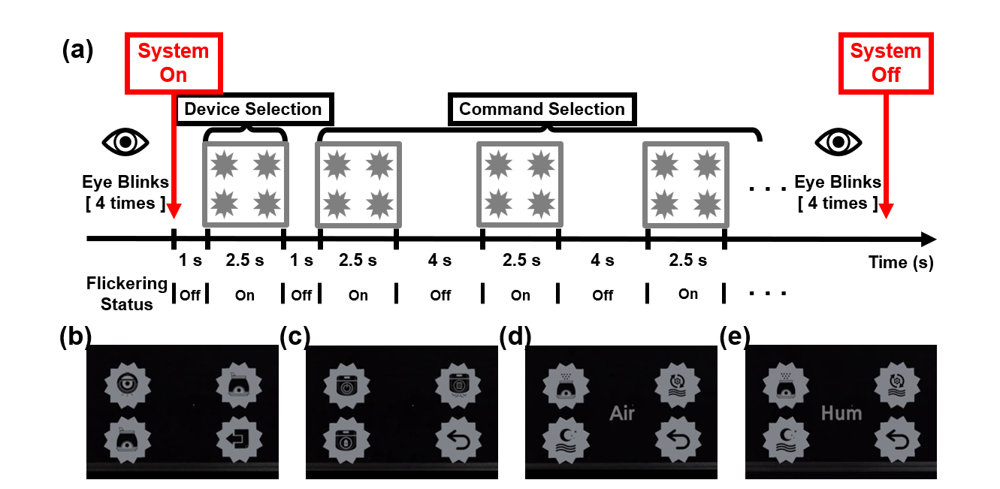

# BCI_Hololnes_Bulb_Control

## 온라인 실험의 전체 절차. 
(a) 제안된 가전 제어 시스템의 계층 구조. 
반복되는 눈 깜박임으로 제어 시스템이 작동한다. 선택된 가전제품에 지정된 명령을 전달하고 나면 사용자의 반복적인 눈 깜빡임으로 제어 시스템이 꺼진다. 
(b) "기기 선택" 단계에 제시된 시각적 자극. (c), (d), (e)는 로봇 진공, 공기청정기, 가습기를 각각 제어하기 위해 "명령 선택" 단계에서 제시한 시각적 자극을 각각 보여준다.
  
