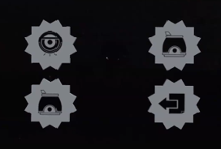
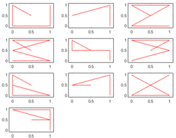
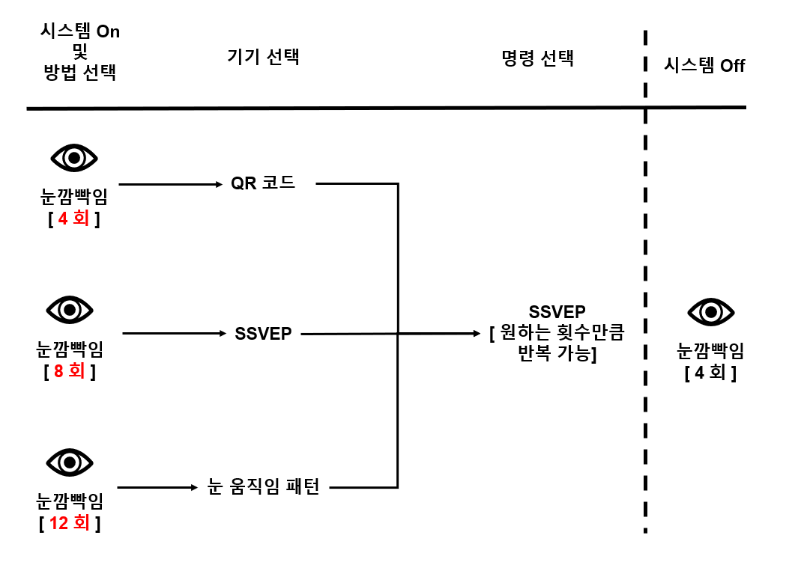
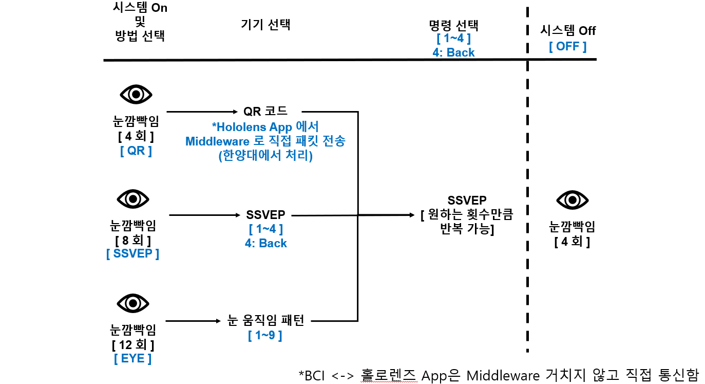

# BCI_Hololnes_Bulb_Control

## 온라인 실험의 전체 절차
(a) 제안된 가전 제어 시스템의 계층 구조. 

반복되는 눈 깜박임으로 제어 시스템이 작동한다. 선택된 가전제품에 지정된 명령을 전달하고 나면 사용자의 반복적인 눈 깜빡임으로 제어 시스템이 꺼진다. 

(b) "기기 선택" 단계에 제시된 시각적 자극. (c), (d), (e)는 로봇 진공, 공기청정기, 가습기를 각각 제어하기 위해 "명령 선택" 단계에서 제시한 시각적 자극을 각각 보여준다.

  

## 제어 대상 기기 선택 방법 - 3종

이름|방식|선택 가능 기기 갯수|사용 시나리오|참고 그림
-|-|-|-|-
QR 코드|선택하고자 하는 기기에 부착된 QR코드 응시|제한 없음|눈앞에 있는 기기를 선택할 때 사용|
SSVEP|기기에 해당하는 SSVEP 자극 응시|3개|눈앞에 없는 기기 중 자주 사용하는 기기를 등록해두고 사용|
눈 움직임 패턴|눈으로 숫자 0~9에 해당하는 패턴 중 하나를 그려 선택|10개|눈앞에 없고 가끔 사용하는 기기를 선택할 때 사용|

## 프로세스 절차

## 통신값 (BCI -> Middleware)

## 기기별 명령 정리

기기 번호|기기명|명령 번호|제어 명령|기타
-|-|-|-|-

<table>
       <thead>
           <tr>
               <th>Layer 1</th>
               <th>Layer 2</th>
               <th>Layer 3</th>
               <th>Layer 3</th>
               <th>Layer 3</th>
           </tr>
       </thead>
       <tbody>
           <tr>
               <td rowspan=4>L1 Name</td>
               <td rowspan=2>L2 Name A</td>
               <td>L3 Name A</td>
           </tr>
           <tr>
               <td>L3 Name B</td>
           </tr>
           <tr>
               <td rowspan=2>L2 Name B</td>
               <td>L3 Name C</td>
           </tr>
           <tr>
               <td>L3 Name D</td>
           </tr>
       </tbody>
</table>
